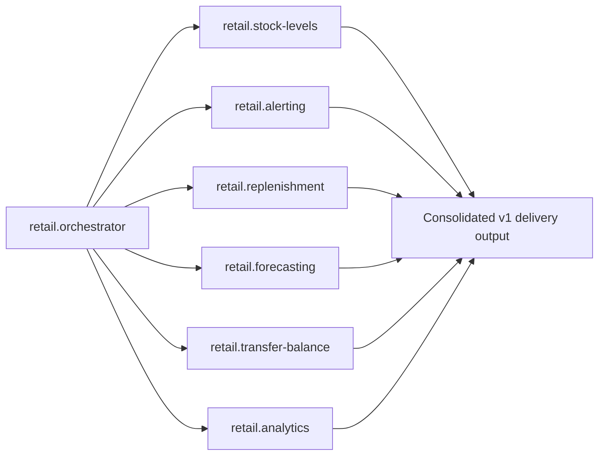

# Spec Agents Agentic Pipeline

## 1) SpecKit Delivery Pipeline (Current Pruned Flow)

```mermaid
flowchart TD
    A[Start] --> B[/speckit.constitution]
    B --> B1[Hook: before_constitution -> speckit.git.initialize (mandatory)]
    B1 --> B2[speckit.constitution]
    B2 --> B3[Optional handoff: speckit.specify]
    B3 --> B4[Hook: after_constitution -> speckit.git.commit (optional)]

    B4 --> C[/speckit.specify]
    C --> C1[Hook: before_specify -> speckit.git.feature (mandatory)]
    C1 --> C2[speckit.specify]
    C2 --> C3[Optional handoff: speckit.plan]
    C2 --> C4[Optional handoff: speckit.clarify]
    C3 --> C5[Hook: after_specify -> speckit.git.commit (optional)]

    C5 --> D[/speckit.plan]
    D --> D1[Hook: before_plan -> speckit.git.commit (optional)]
    D1 --> D2[speckit.plan]
    D2 --> D3[Handoff: speckit.tasks]
    D3 --> D4[Hook: after_plan -> speckit.git.commit (optional)]

    D4 --> E[/speckit.tasks]
    E --> E1[Hook: before_tasks -> speckit.git.commit (optional)]
    E1 --> E2[speckit.tasks]
    E2 --> E3[Handoff: speckit.implement]
    E3 --> E4[Hook: after_tasks -> speckit.git.commit (optional)]

    E4 --> F[/speckit.implement]
    F --> F1[Hook: before_implement -> speckit.git.commit (optional)]
    F1 --> F2[speckit.implement]
    F2 --> F3[Hook: after_implement -> speckit.git.commit (optional)]
    F3 --> G[Done]
```

## 2) Retail Domain Orchestrator Pipeline



## 3) Recommended Calling Sequence for Your Current Project

1. Run /speckit.constitution only when governance needs updates.
2. Run /speckit.specify to create or refine the feature spec.
3. Run /speckit.plan to produce architecture and implementation artifacts.
4. Run /speckit.tasks to generate dependency-ordered execution tasks.
5. Run /speckit.implement to execute tasks in phases.
6. Run retail.orchestrator when the work spans multiple retail capabilities in parallel.

## 4) Active Speckit Agents in This Pruned Setup

- speckit.constitution
- speckit.specify
- speckit.analyze
- speckit.clarify
- speckit.plan
- speckit.tasks
- speckit.implement
