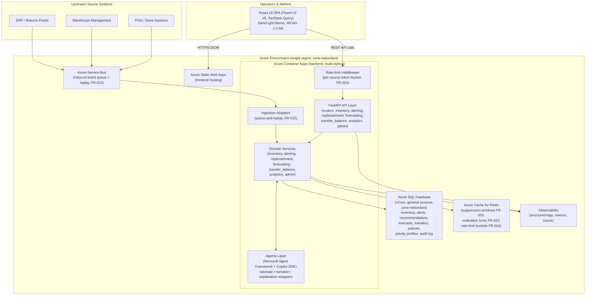

# Architecture: Retail Replenishment V1 Foundation

**Spec**: [spec.md](./spec.md) | **Plan**: [plan.md](./plan.md) | **Data Model**: [data-model.md](./data-model.md)

This diagram summarizes the system architecture described in `plan.md` (Technical Context, Project Structure) and `research.md` (technology decisions). It is informational — the authoritative technical decisions live in `plan.md` and `research.md`.

## System Context and Component Diagram

## Component Notes

- **Frontend**: React 18 + Fluent UI v9 SPA hosted on Azure Static Web Apps; consumes the backend REST API via TanStack Query; supports dark/light themes and WCAG 2.2 AA accessibility across alerts, recommendations, approvals, and dashboards (Constitution IV).
- **API layer**: FastAPI on Azure Container Apps, multi-replica for zone redundancy (SC-009). A rate-limiting middleware backed by Redis enforces per-source-system ingestion limits (FR-024, HTTP 429 + `Retry-After`).
- **Domain services**: One module per bounded context (inventory, alerting, replenishment, forecasting, transfer_balance, analytics, admin), matching the backend project structure in `plan.md`. Contains deterministic policy logic (thresholds, reorder points, transfer feasibility, priority scoring).
- **Agents layer**: Microsoft Agent Framework + Copilot SDK wrappers used only for explanation, rationale, and narration (e.g., replenishment rationale, forecast narration, store-priority explanation). Agents never bypass deterministic domain safeguards.
- **Ingestion**: Inbound events from POS/WMS/ERP source systems flow through Azure Service Bus, enabling queue-and-replay resilience during upstream outages (FR-022) before reaching domain services.
- **Storage**: Azure SQL Database is the system of record for all domain entities; Azure Cache for Redis handles suppression windows, evaluation locks, and rate-limit token buckets.
- **Observability**: Structured logs, metrics, and traces are emitted from the API layer and domain services to support audit trails (FR-014, FR-018) and operational trustworthiness (Constitution V).
- **Reliability**: Single-region, zone-redundant deployment across Container Apps, Azure SQL Database, Redis, and Service Bus is the basis for the 99.9% monthly uptime target (SC-009), per the Deployment target decision in `research.md`.
